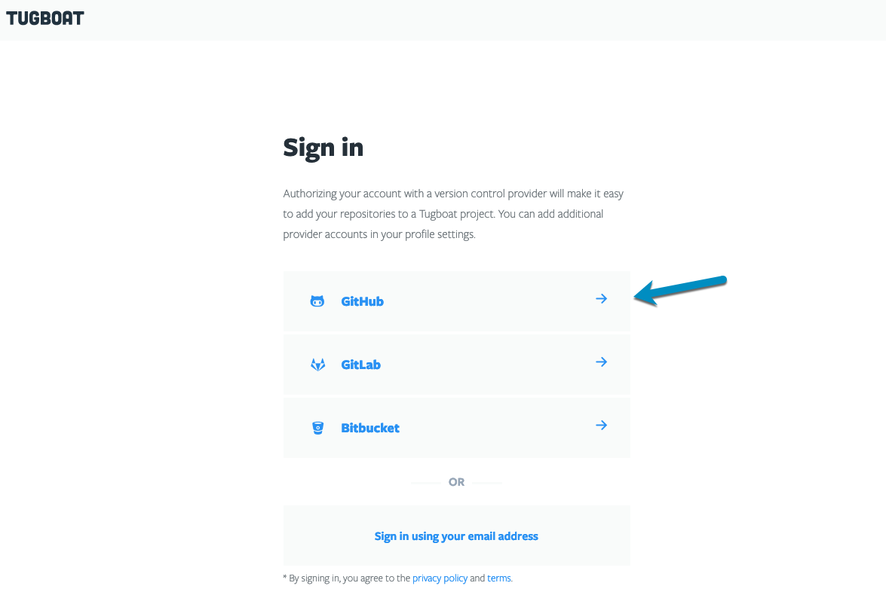
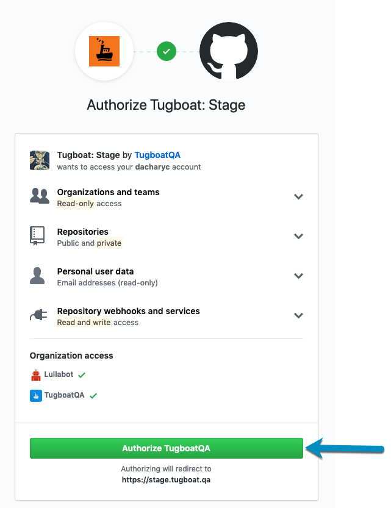
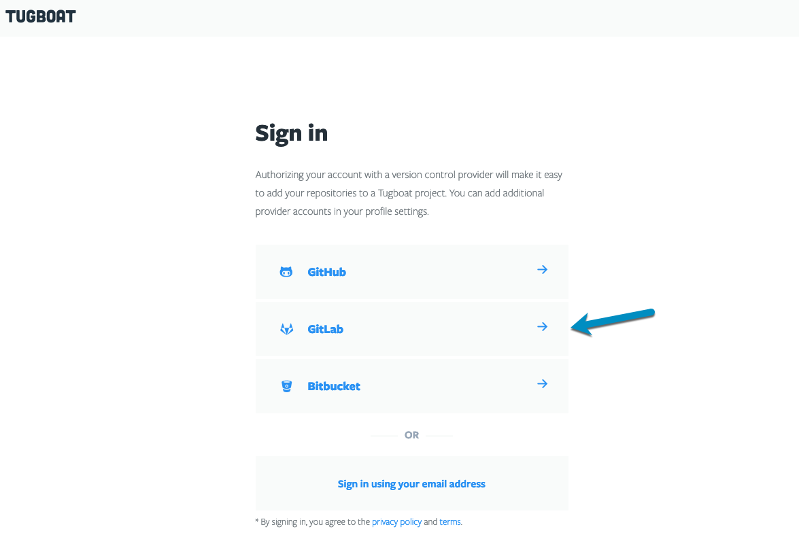
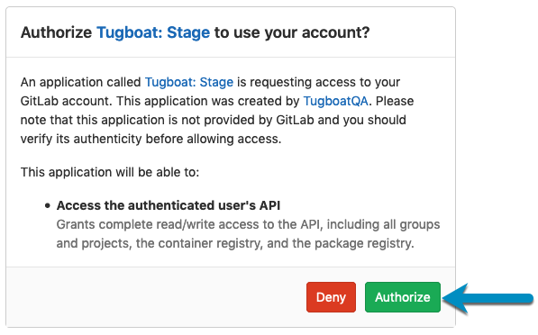
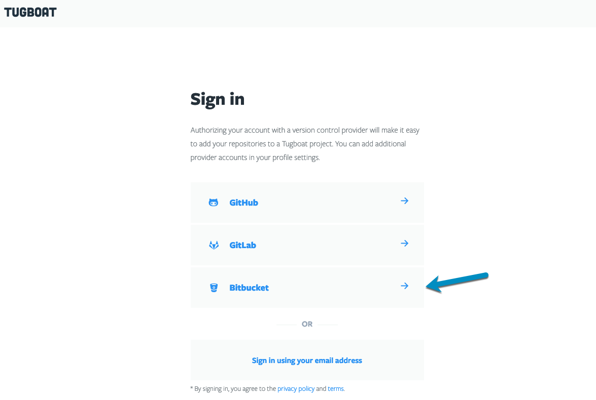
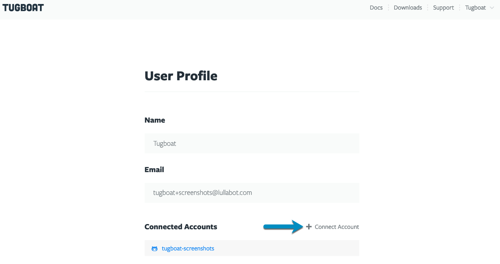
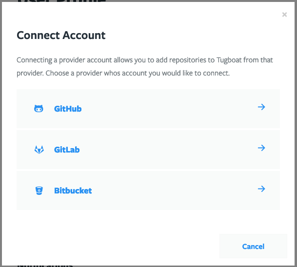

- [GitHub](#github)
- [GitLab](#gitlab)
- [Bitbucket](#bitbucket)
- [Generic git server](#generic-git-server)
- [Add a link to an additional git provider](#adding-a-link-to-a-git-provider)

## GitHub

- [How to connect Tugboat to GitHub](#how-do-i-link-tugboat-to-github)
- [Using the GitHub integration](#using-the-github-integration)

### How do I link Tugboat to GitHub?

1. Go to [Sign In](https://dashboard.tugboat.qa/) and select GitHub.
2. Enter your GitHub Username and Password (or Create an Account), complete
   Two-Factor Authentication.
3. Authorize Tugboat.

Once you complete GitHub authorization, you'll be redirected to the
[Create a Tugboat Project](../create-a-new-project/) screen.

{}

Go to [Sign In](https://dashboard.tugboat.qa/) and select GitHub.

Enter your GitHub Username and Password (or Create an Account), complete
Two-Factor Authentication.

Authorize Tugboat.

Once you complete GitHub authorization, you'll be redirected to the
[Create a Tugboat Project](../create-a-new-project/) screen.

{}

### Using the GitHub integration

The GitHub integration gives Tugboat the following features, which you can
access in your Project -> Repository Settings:

- {}Build Pull Requests automatically{} On by
  default; Tugboat automatically creates a Preview when a GitHub pull request is
  opened.
- {}Rebuild updated Pull Requests automatically{} On
  by default; Tugboat automatically rebuilds a Preview when the corresponding
  pull request is updated.
- {}Delete Pull Request Previews automatically{} On
  by default; Tugboat automatically deletes a Preview when its pull request is
  merged or closed.
- {}Set Pull Request status{} On by default; Tugboat
  updates the pull request status to reflect the state of its Preview.
- {}Set Pull Request deployment status{} Off by
  default; Tugboat adds a deployment update to the pull request when a Preview
  is built.
- {}Post Preview links in Pull Request comments{} Off
  by default; Tugboat adds a comment to a pull request with links to its
  Preview. The comment author is the person who authenticated the git repo to
  Tugboat; to change this, see:
  [Add a Tugboat Bot to your team](../../administer-tugboat-crew/user-admin/#add-a-tugboat-bot-to-your-team).
- {}Build Previews for forked Pull Requests{} Off by
  default; Tugboat builds Previews for pull requests made to the primary repo
  from forked repositories. **There are security implications from using this
  setting:** any secrets in your Preview will be accessible by the owner of the
  forked repository. When this feature is not enabled, forked pull requests show
  as available to build (or will attempt to build automatically if you have
  {}Build Pull Requests Automatically{} enabled) but
  the Preview build will fail.

You can also specify the account from which comments are posted to GitHub in
this section. For info on customizing this, see:
[Add a Tugboat Bot to your team](../../administer-tugboat-crew/user-admin/#add-a-tugboat-bot-to-your-team).

## GitLab

- [How to connect Tugboat to GitLab](#how-do-i-link-tugboat-to-gitlab)
- [Using the GitLab integration](#using-the-gitlab-integration)

### How do I link Tugboat to GitLab?

1. Go to [Sign In](https://dashboard.tugboat.qa/) and select GitLab.
2. Enter your GitLab Username and Password (or Register).
3. Authorize Tugboat.

Once you complete GitLab authorization, you'll be redirected to the
[Create a Tugboat Project](../create-a-new-project/) screen.

{}

Go to [Sign In](https://dashboard.tugboat.qa/) and select GitLab.

Enter your GitLab Username and Password (or Register).

Authorize Tugboat.

Once you complete GitLab authorization, you'll be redirected to the
[Create a Tugboat Project](../create-a-new-project/) screen.

{}

### Using the GitLab integration

The GitLab integration gives your Tugboat the following features, which you can
access in your Project -> Repository Settings:

- {}Build Merge Requests automatically{} On by
  default; Tugboat automatically creates a Preview when a GitLab merge request
  is opened.
- {}Rebuild updated Merge Requests automatically{} On
  by default; Tugboat automatically creates a Preview when the corresponding
  merge request is updated.
- {}Delete Merge Request Previews automatically{} On
  by default; Tugboat automatically deletes a Preview when its merge request is
  merged or closed.
- {}Set Merge Request build status{} On by default;
  Tugboat updates the merge request build status to reflect the state of its
  Preview.
- {}Post Preview links in Merge Request comments{}
  Off by default; Tugboat adds a comment to a merge request with links to its
  Preview. The comment author is the person who authenticated the git repo to
  Tugboat; to change this, see:
  [Add a Tugboat Bot to your team](../../administer-tugboat-crew/user-admin/#add-a-tugboat-bot-to-your-team).
- {}Build Previews for forked Merge Requests{} Off by
  default; Tugboat builds Previews for merge requests made to the primary repo
  from forked repositories. **There are security implications from using this
  setting:** any secrets in your Preview will be accessible by the owner of the
  forked repository. When this feature is not enabled, forked merge requests
  show as available to build (or will attempt to build automatically if you have
  {}Build Merge Requests Automatically{} enabled) but
  the Preview build will fail.

You can also specify the account from which comments are posted to GitLab in
this section. For info on customizing this, see:
[Add a Tugboat Bot to your team](../../administer-tugboat-crew/user-admin/#add-a-tugboat-bot-to-your-team).

## Bitbucket

- [How to connect your Tugboat to Bitbucket](#how-do-i-link-tugboat-to-bitbucket)
- [Using the Bitbucket integration](#using-the-bitbucket-integration)

### How do I link Tugboat to Bitbucket?

1. Go to [Sign In](https://dashboard.tugboat.qa/) and select Bitbucket.
2. Enter your Bitbucket Email and Password (or Sign up for an account).
3. Grant Access to Tugboat.

Once you complete Bitbucket authorization, you'll be redirected to the
[Create a Tugboat Project](../create-a-new-project/) screen.

{}

Go to [Sign In](https://dashboard.tugboat.qa/) and select Bitbucket.

Enter your Bitbucket Email and Password (or Sign up for an account).

Grant Access to Tugboat.

Once you complete Bitbucket authorization, you'll be redirected to the
[Create a Tugboat Project](../create-a-new-project/) screen.

{}

### Using the Bitbucket integration

The BitBucket integration gives Tugboat the following features, which you can
access in your Project -> Repository Settings:

- {}Build Pull Requests automatically{} On by
  default; Tugboat automatically creates a Preview when a Bitbucket pull request
  is opened.
- {}Rebuild updated Pull Requests automatically{} On
  by default; Tugboat automatically rebuilds a Preview when the corresponding
  pull request is updated.
- {}Delete Pull Request Previews automatically{} On
  by default; Tugboat automatically deletes a Preview when its pull request is
  merged or closed.
- {}Set Pull Request status{} On by default; Tugboat
  updates the pull request status to reflect the state of its Preview.
- {}Post Preview links in Pull Request comments{} Off
  by default; Tugboat adds a comment to a pull request with links to its
  Preview. The comment author is the person who authenticated the git repo to
  Tugboat; to change this, see:
  [Add a Tugboat Bot to your team](../../administer-tugboat-crew/user-admin/#add-a-tugboat-bot-to-your-team).
- {}Build Previews for forked Pull Requests{} Off by
  default; Tugboat builds Previews for pull requests made to the primary repo
  from forked repositories. **There are security implications from using this
  setting:** any secrets in your Preview will be accessible by the owner of the
  forked repository. When this feature is not enabled, forked pull requests show
  as available to build (or will attempt to build automatically if you have
  {}Build Pull Requests Automatically{} enabled) but
  the Preview build will fail.

You can also specify the account from which comments are posted to Bitbucket in
this section. For info on customizing this, see:
[Add a Tugboat Bot to your team](../../administer-tugboat-crew/user-admin/#add-a-tugboat-bot-to-your-team).

## Generic Git Server

If you're not using GitHub, GitLab, or Bitbucket, you can use a generic git
server with Tugboat. You'll [sign in to Tugboat](https://dashboard.tugboat.qa/)
using an email address, and when you go to add a repo to your Tugboat project,
you can link to a Git URL.

{} If your repo isn't connected via Tugboat's GitHub,
GitLab, or Bitbucket authentication, you won't have the integration features to
automatically build Previews from Pull Requests, and other related
functionality. If you add GitHub, GitLab, or Bitbucket authentication later,
you'll need to delete your generic git server from your project, and add it
again to use it. {}

## Adding a link to a git provider

Need to add a git provider to your Tugboat account? Whether you created your
initial Tugboat account with an email and now want to add a git provider, or
whether you're adding your second or third git provider, here's how to connect
your Tugboat account with additional git providers:

1. Click the {}User{} drop-down in the upper
   right-hand corner of the Tugboat dashboard, and select
   {}Profile{}.
2. Click the {}+ Connect Account{} link.
3. Select the git provider whose account you'd like to connect.
4. Follow the instructions to connect to
   [GitHub](#how-do-i-link-tugboat-to-github),
   [GitLab](#how-do-i-link-tugboat-to-gitlab) or
   [Bitbucket](#how-do-i-link-tugboat-to-bitbucket).

{}

Click the {}User{} drop-down in the upper right-hand
corner of the Tugboat dashboard, and select
{}Profile{}.

Click the {}+ Connect Account{} link.

Select the git provider whose account you'd like to connect.

Follow the instructions to connect to  
 [GitHub](#how-do-i-link-tugboat-to-github), [GitLab](#how-do-i-link-tugboat-to-gitlab)
or [Bitbucket](#how-do-i-link-tugboat-to-bitbucket).

{}
