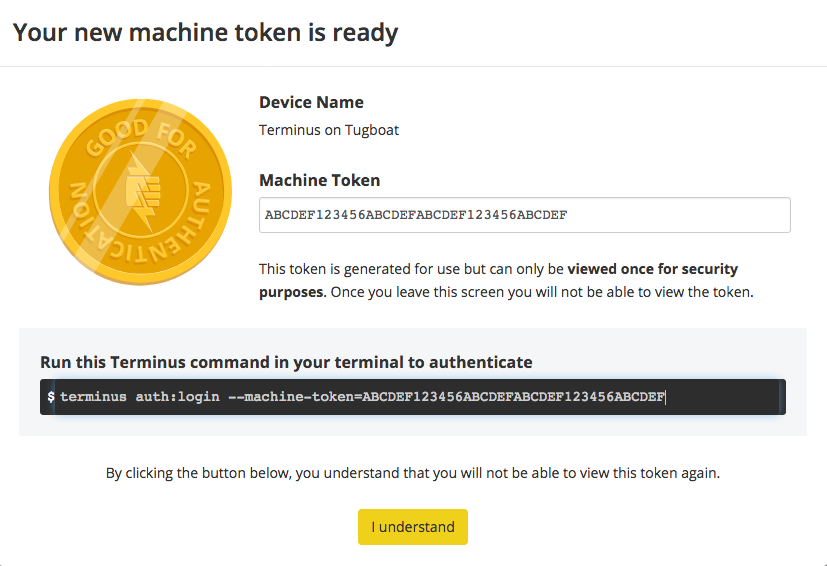

# Configure terminus

Tugboat will need to use Pantheon's
[terminus](https://pantheon.io/docs/terminus/) command to pull a database and
files for your project. If you haven't used terminus before, don't worry—we will
figure it out together.

## Create a Pantheon user for Tugboat to use

> #### Danger::Do not skip this step
>
> Because of how terminus machine tokens work, you cannot restrict their access
> to a single Pantheon project. This means that by sharing your machine token
> with Tugboat, anyone else that has access to your Tugboat project could gain
> access to your personal Pantheon account, including any other Pantheon
> projects that account has access to.

To mitigate the above risk, **you must create a separate user account** on
Pantheon solely for Tugboat to use. You can then give this user access to just
the one Pantheon project it needs, and safely share the machine token for that
user with Tugboat.

1. If you're logged in to your personal account on Pantheon,
   [log out](https://dashboard.pantheon.io/logout).
2. [Register a new account](https://dashboard.pantheon.io/register) on Pantheon.
3. Specify a unique email address, ideally using an email alias.
4. Name your user something recognizeable, like _Tugboat User_.

> #### Hint::Use an email alias
>
> Many email clients allow you to easily generate aliases, or allow you to
> dynamically have an alias. For example, on gmail, if your email address is
> `dorothy@gmail.com`, you could use the `+` symbol followed by a unique string
> to create an alias for this tugboat user, e.g.
> `dorothy+tugboat-pantheon@gmail.com`.

## Generate Pantheon machine token

Now that we have a new user that Tugboat can use, we will need to generate a
machine token for this account on Pantheon. While logged in as this new user, go
to
[Machine Tokens](https://dashboard.pantheon.io/user?destination=%2Fuser#account/tokens/create/terminus/)
which is under your account settings. You can name this token whatever you'd
like, such as `Terminus on Tugboat`:

Once you've picked a name, click _Generate Token_. You will then be presented
with a screen with your machine token visible. **Store this token in a secure
place, such as a password manager or OS keychain.**

## Add your new Pantheon user to your Pantheon project

Now that you've generated a machine token for your new Pantheon user, you still
need to add this user to your Pantheon project. To do this, log out of Pantheon
and then log back in with your personal Pantheon account. Then, navigate to your
Pantheon project, and click _Team_ from the header. Finally, enter the email
address of the new Pantheon user you created above and click the _Add to team_
button.

## Store the machine token as a Tugboat environment variable

> #### Warning::Do not store the token in your repo
>
> For the security of your Pantheon site, it's important to use an environment
> variable to store the machine token, instead of committing it to your
> repository or storing it in some other fashion.

Now that we have our Pantheon machine token, and our new user is a member of our
Pantheon project, we need to store the machine token securely within Tugboat. To
do this, we will use Tugboat's
[custom environment variables](../../../../build-script/custom-environment-variables/index.md).
Navigate to your Tugboat Repository's Settings page in the Repository
Configuration section on the Services tab. Then add a new environment variable
called `PANTHEON_MACHINE_TOKEN`, setting it to the value of the token that
Pantheon provided earlier.

1. Click _Services_ on the Repository Settings page
2. Enter the environment variable as
   `PANTHEON_MACHINE_TOKEN=ABCDEF123456ABCDEF123456`
3. Click _Add_
4. Click _Save Configuration_

---

Progress! Next up, we'll add the build script that will use this new environment
variable.

#### Next: [Add a build script](../add-build-script/index.md)
