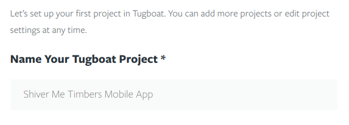
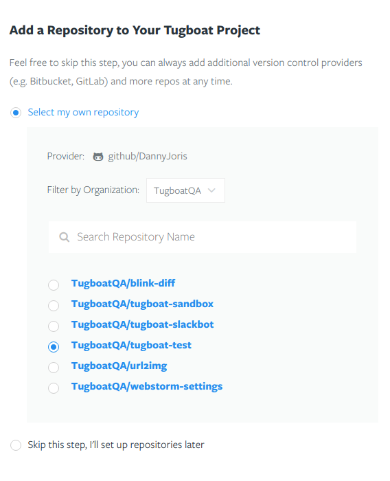
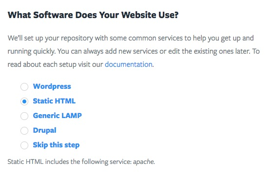
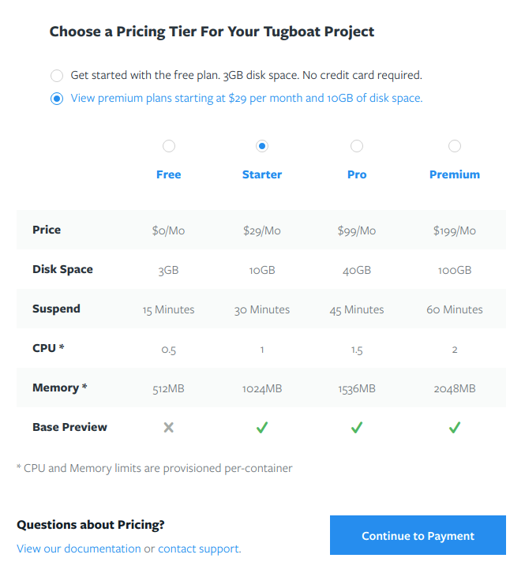

# Create a Project

When authenticating to Tugboat for the first time you will be presented with a
form to create your first Tugboat Project. A Tugboat Project can
contain any number of repositories that you want Tugboat to build previews for, and
is tied to a subscription model (free or premium). Additionally, you can invite
users to join a project.

Start by giving your Tugboat Project a name.

Then, choose a repository that you want Tugboat to work with. If you choose to
skip this step, repositories can be added later from the Tugboat Project's
dashboard.

Tugboat needs to know which services your repository needs in order to run. We
provide a handful of common sets of services as a quick starting point. These
services can be modified later from the [Repository
Settings](../tugboat-dashboard/repository/settings/index.md).

Finally, select a pricing tier for your project. Use the feature matrix to
decide which tier best suits your needs. If in doubt, select the Free tier, and
upgrade as needed when you start to run into the limits.

Besides more available disk space, CPU, and memory, the ability to create [Base
Previews](../base-previews/index.md) is a major bonus to selecting a paid tier.
[Base Previews](../base-previews/index.md) allow Tugboat to speed up build times
and significanly reduces the amount of disk space a given preview occupies.

After completing this form, you will be redirected to either the [Repository
dashboard](../tugboat-dashboard/repository/dashboard/index.md) page or the
[Project dashboard](../tugboat-dashboard/projects/dashboard/index.md) page
depending whether you selected a repository. You can always add one or more
Repositories later from the Project Dashboard:

