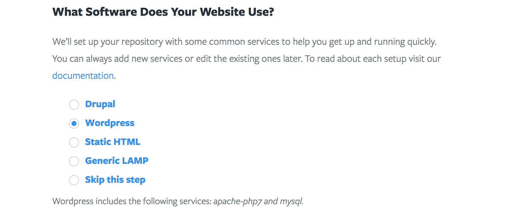
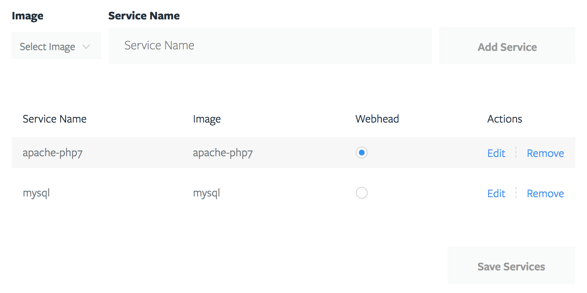

# Wordpress

These instructions show how to configure Tugboat for a typical Wordrepss
repository. Every site tends to have slightly different requirements, so
further customization may be required, but this should get you started.

## Services

In order to serve a Wordpress site, and apache webhead with PHP needs to be
selected. Wordpress has fairly loose requirements around PHP versions, so
either of these Tugboat Services should work fine.

* apache-php (php-5.5.9)
* apache-php7 (php-7.0.26)

In addition, a MySQL or MariaDB database service neeeds to be selected

* mysql (mysql-5.5.4)
* mariadb (mariadb-5.5.54)

When selecting the Wordpress template, the `apache-php7` and `mysql` services
are automatically selected, so that is what we will use for this example.



The resulting set of services for the repository should look like the following



## Wordpress Configuration

In order for Wordpress to use environment-specific settings, some changes need
to be made to `wp-config.php`. One popular method is to commit a "default"
version of the file to the git repository, and include a "local" config file
with override options. That local file should not be included in the git
repository.

These are the settings we are particularly interested in for Tugboat, but the
concept could be easily extended to cover the remaining settings in
`wp-config.php`

```php
if ( file_exists( dirname( __FILE__ ) . '/wp-config.local.php' ) )
    include(dirname(__file__) . '/wp-config.local.php');

// ** MySQL settings - You can get this info from your web host ** //
/** The name of the database for WordPress */
if ( !defined('DB_NAME') )
    define('DB_NAME', 'database_name_here');

/** MySQL database username */
if ( !defined('DB_USER') )
    define('DB_USER', 'username_here');

/** MySQL database password */
if ( !defined('DB_PASSWORD') )
    define('DB_PASSWORD', 'password_here');

/** MySQL hostname */
if ( !defined('DB_HOST') )
    define('DB_HOST', 'localhost');
```

## Build Script

The build script for a Wordpress repository consists of these main parts

* Point Tugboat to the right document root
* Install prerequisite packages
* Create/Import a database, and update the site URL
* Import `wp-content/uploads`
* Update the Wordpress configuration

### Configure a Document Root

By default, Tugboat tries to serve content from a `/docroot` folder in the root
of your git repository. If your repository already has Wordpress in this
location, this step can be skipped.

To point Tugboat to the right location in your repository, add a line to the
`tugboat-init` section of the build script. To serve content from `/public_html`
in your repository add this.


```sh
ln -sf ${TUGBOAT_ROOT}/public_html /var/www/html
```

Or, to serve directly from the root of your repository

```sh
ln -sf ${TUGBOAT_ROOT} /var/www/html
```

### Install Prerequisite Packages

Tugboat lets you customize your preview environment however you need. We are
going to need a few packages that are not installed by default, such as `rsync`,
`mysql-client`, and `wp-cli`. To do that, add the following to the
`tugboat-init` section of the build script. Add any other packages here that you
might need while you are at it.

```sh
apt-get update
apt-get install -y mysql-client rsync
curl -O https://raw.githubusercontent.com/wp-cli/builds/gh-pages/phar/wp-cli.phar
chmod +x wp-cli.phar
mv wp-cli.phar /usr/local/bin/wp
```

### Create/Import a database

Before you can import a database into a Tugboat Preview, it needs to be
accessible somewhere on the internet. There are a number of ways to do that, but
for this example we are going to assume that a recent mysqldump file is
available somewhere that can be accessed via SSH.

First, visit your [Repository
Settings](../tugboat-dashboard/repository/dashboard/index.md), and copy the
repository's public SSH key to the server hosting the mysqldump file. This
should typically go in a file at `~/.ssh/authorized_keys` in the home directory
of the user on the remote server that has access to the mysqldump file.


Add the following to the `tugboat-init` section of the build script to create a
database

```sh
mysql -h mysql -u tugboat -ptugboat -e "create database demo;"
```

Add the following  to the `tugboat-init` and `tugboat-update` sections of the
build script to import a fresh copy of the database and update the wordpress
URL

```sh
scp user@example.com:database.sql.gz /tmp/database.sql.gz
zcat /tmp/database.sql.gz | mysql -h mysql -u tugboat -ptugboat demo
wp --allow-root --path=/var/www/html search-replace 'wordpress.local' "${TUGBOAT_PREVIEW}-${TUGBOAT_TOKEN}.${TUGBOAT_DOMAIN}" --skip-columns=guid
```

### Import wp-content/uploads

Just like the database, in order to import the `wp-content/uploads` folder, it
needs to be accessible over the public internet somehow. Again, there are a
number of different ways of doing that, but for this example we are going to
assume we can rsync that directory from a server via SSH.

Visit your [Repository
Settings](../tugboat-dashboard/repository/dashboard/index.md), and copy the
repository's public SSH key to the server hosting the folder we are going to
sync. This should typically go in a file at `~/.ssh/authorized_keys` in the home
directory of the user on the remote server that has access to the folder.


Add the following to the `tugboat-init` and `tugboat-update` sections of the
build script.

```sh
mkdir -p /var/www/html/wp-content/uploads || /bin/true
rsync -av --delete user@example.com:/path/to/wp-content/uploads/ /var/www/html/wp-content/uploads/
chgrp -R www-data /var/www/html/wp-content/uploads
find /var/www/html/wp-content/uploads -type d -exec chmod 2775 {} \;
find /var/www/html/wp-content/uploads -type f -exec chmod 0664 {} \;
```

### Update the Wordpress Configuration

Finally, configure Wordpress to use the new database by generating a
`wp-config.local.php` file. Add the following to the `tugboat-init` section of
the build script.

```sh
echo "<?php" > /var/www/html/wp-config.local.php
echo "define('DB_NAME','demo');" >> /var/www/html/wp-config.local.php
echo "define('DB_USER','tugboat');" >> /var/www/html/wp-config.local.php
echo "define('DB_PASSWORD','tugboat');" >> /var/www/html/wp-config.local.php
echo "define('DB_HOST','mysql');" >> /var/www/html/wp-config.local.php
```

### Full Makefile

This Makefile pulls everything above together into a single file. It takes
advantage of some code reuse, and cleans up temp files at the end to keep the
preview disk space usage down a little.

**Make sure the indents are TABs if this is copied & pasted.**

```sh
packages:
    apt-get update
    apt-get install -y mysql-client rsync
    curl -O https://raw.githubusercontent.com/wp-cli/builds/gh-pages/phar/wp-cli.phar
    chmod +x wp-cli.phar
    mv wp-cli.phar /usr/local/bin/wp

wpconfig:
    echo "<?php" > /var/www/html/wp-config.local.php
    echo "define('DB_NAME','demo');" >> /var/www/html/wp-config.local.php
    echo "define('DB_USER','tugboat');" >> /var/www/html/wp-config.local.php
    echo "define('DB_PASSWORD','tugboat');" >> /var/www/html/wp-config.local.php
    echo "define('DB_HOST','mysql');" >> /var/www/html/wp-config.local.php

createdb:
    mysql -h mysql -u tugboat -ptugboat -e "create database demo;"

importdb:
    scp user@example.com:database.sql.gz /tmp/database.sql.gz
    zcat /tmp/database.sql.gz | mysql -h mysql -u tugboat -ptugboat demo
    wp --allow-root --path=/var/www/html search-replace 'wordpress.local' "${TUGBOAT_PREVIEW}-${TUGBOAT_TOKEN}.${TUGBOAT_DOMAIN}" --skip-columns=guid

importuploads:
    mkdir -p /var/www/html/wp-content/uploads || /bin/true
    rsync -av --delete user@example.com:/path/to/wp-content/uploads/ /var/www/html/wp-content/uploads/
    chgrp -R www-data /var/www/html/wp-content/uploads
    find /var/www/html/wp-content/uploads -type d -exec chmod 2775 {} \;
    find /var/www/html/wp-content/uploads -type f -exec chmod 0664 {} \;

cleanup:
    apt-get clean
    rm -rf /var/lib/apt/lists/* /tmp/* /var/tmp/*

tugboat-init: packages wpconfig createdb importdb importuploads cleanup
tugboat-update: importdb importuploads cleanup
tugboat-build:
    wp --allow-root --path=/var/www/html search-replace "${TUGBOAT_BASE_PREVIEW}-${TUGBOAT_BASE_PREVIEW_TOKEN}.${TUGBOAT_DOMAIN}" "${TUGBOAT_PREVIEW}-${TUGBOAT_TOKEN}.${TUGBOAT_DOMAIN}" --skip-columns=guid
```
