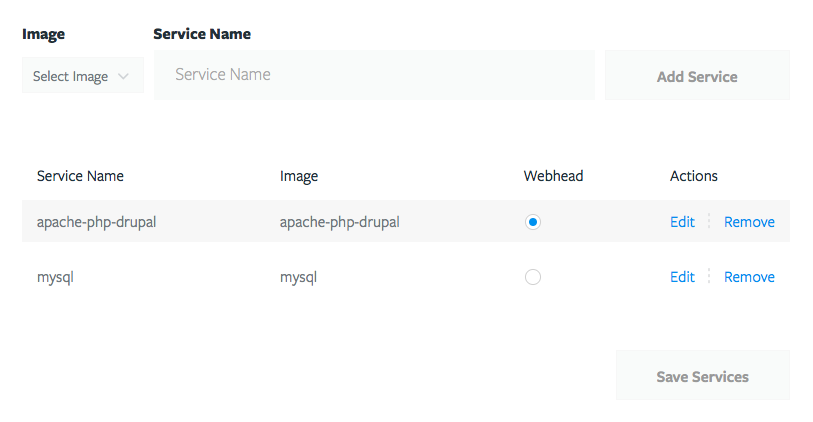

# Drupal

These instructions show how to configure Tugboat for a typical Drupal 7 or
Drupal 8 repository. Every Drupal site tends to have slightly different
requirements, so further customizations may be required. This should get you
started, though.

## Services

In order to serve a Drupal site, an apache webhead with PHP needs to be
selected. Tugboat provides services that also include Drush, which is commonly
required for server-side scripting. Both Drupal 7 and Drupal 8 work with PHP
5.5.9, so we will use that for this example.

In addition, a MySQL or MariaDB database service needs to be selected.



## Drupal Configuration

Add the following to the end of `settings.php` to let Drupal know where to find its database

```php
$tugboat = getenv('TUGBOAT_PREVIEW_ID');
if (!empty($tugboat)) {
  $databases['default']['default'] = [
    'database' => 'drupal',
    'username', 'tugboat',
    'password', 'tugboat',
    'host', 'mysql',
  ];
}
```

## Build Script