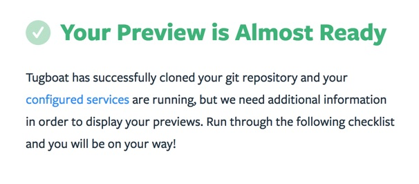
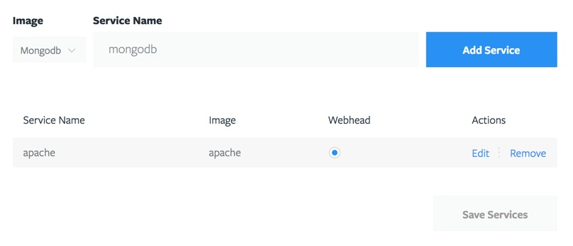

# Your First Preview

## Build a Preview

When you add your Repository to your Project you have the ability to build a Preview from any Pull Request, Tag, or Branch that is available in the repository. Go ahead and build your first preview. A good place to start is from a `master` or `dev` branch.


The Preview will build and the status indicator will likely turn to "ready" and it's preview button will be activated. Go ahead and click that preview button. 


Unless the repository is already set up to work with Tugboat, there's a good chance you'll see a page with the following heading:



This means that Tugboat prepared the server and deployed your code, but it needs additional configuration for it to work. The 2 most likely cases are that it is missing one or more services like Apache, or that a root path isn't defined, which means Tugboat doesn't know the path to serve up the application. The page you'll see has some helpful information about what Tugboat is missing so please give it a read, but we'll go trough some of it here as well.

## Requirements For A Working Preview

To get a working Preview, make sure you have the following set up:

**In the Repository settings:**
- Include and configure all _Services_ your Preview require.

**In your code:**
- A _Makefile_ in the root of your repository.

### Services

 Simple static sites often only need Apache or Nginx, but more advanced builds may require services like "Apache with PHP", Mysql, Couchdb, Nodejs, Memcached or others. Adding Services is as simple as selecting them from the dropdown and naming them. Make sure you have a webhead selected. A webhead is the service that will serve up your application. This is usually Apache or Nginx.



Editing a Service allows you to change the name and add a [Ready Command](/tugboat-dashboard/repository/settings/index.md#editing-a-service) to be called to verify if the particular Service is ready.

 ### Makefile

Many applications require several commands or a build script to be set up. This ranges from installing node packages, compiling code, to normalizing user data in a database. Your build scripts can be triggered from a Makefile at the root of your repository. There are 3 commands Tugboat calls at different stages in the build: `tugboat-init`, `tugboat-update`, and `tugboat-build`.

- `tugboat-init`: Build a preview from scratch
- `tugboat-build`: Build a preview from a base preview, the assumption being that things like a database and files are already present so not all the steps from `tugboat-init` are required.
- `tugboat-update`: Refresh a preview. Somewhere between `tugboat-init` and `tugboat-build`, in a way that there is already data, but it needs to be updated or refreshed.

```
# called when a preview is built from scratch
tugboat-init:
  echo "Calling tugboat-init"
  # install packages
  # configure services
  # get the containers ready for your application
  # call tugboat-update()

# called when an existing preview is updated
tugboat-update:
  echo "Calling tugboat-update"
  # pull in fresh data, if applicable
  # call tugboat-build()

# called when a preview is built from a Base Preview
tugboat-build:
  echo "Calling tugboat-build"
  # run application specific scripts
  # compile, uglify, etc
```

List all commands you want to execute in the Makefile target. Make sure to use a single tab instead of spaces for indentation. Alternatively, you can refer to custom shell scripts to do the heavy lifting like so:

```
tugboat-init:
  scripts/init.sh

tugboat-update:
  scripts/update.sh

tugboat-build:
  scripts/build.sh
```

You can point to any scripts from here. The folder and file names are just examples.

Check out the [Guides](guides/index.md) for more detailed info and scenarios on how to set up your preview.
