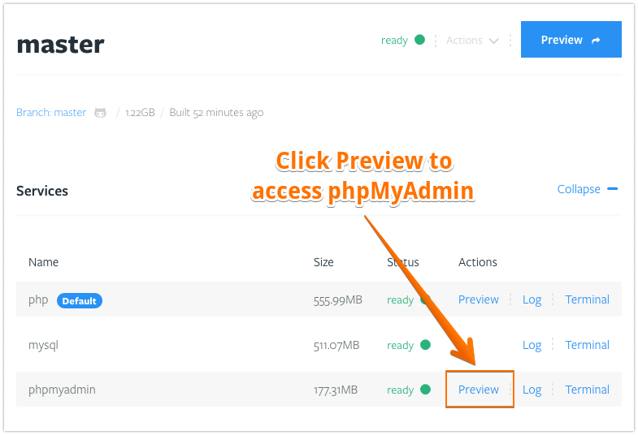

# Adding a phpMyAdmin Service

Database management tools such as MySQL Workbench or Sequel Pro are commonly
used by developers to work with a MySQL database. However, Tugboat does not
provide a way for these tools to connect to a database in a Preview. A popular
alternative is to use [phpMyAdmin](https://www.phpmyadmin.net/) to fill this
gap.

> #### Warning::
>
> Exposing a phpMyAdmin service grants full access to the database for the
> Tugboat Preview to anyone who has the link. While it is best practice to avoid
> storing sensitive data in Tugboat, it is still a good idea to be careful about
> sharing this link.

You can use the official phpMyAdmin
[Docker image](https://hub.docker.com/r/phpmyadmin/phpmyadmin) can with Tugboat.
Here is an example
[config file](../../setting-up-tugboat/index.md#create-a-tugboat-config-file)
showing how you might add a phpmyadmin service to a Tugboat Preview:

```yaml
services:
  mysql:
    image: tugboatqa/mysql:5
  phpmyadmin:
    expose: 80
    image: phpmyadmin/phpmyadmin
```

> #### Hint::MySQL 8
>
> MySQL 8 uses a new authentication method, which does not work with the PHP
> mysqli extension that phpMyAdmin uses. To work around this, alter the
> "tugboat" MySQL user with an init command for the `mysql` service.
>
> ```yaml
> mysql:
>   image: tugboatqa/mysql:8
>   commands:
>     init:
>       mysql -e "ALTER USER 'tugboat'@'%' IDENTIFIED WITH mysql_native_password
>       BY 'tugboat';"
> ```

Once you've added the phpmyadmin service to your Tugboat config, you will need
to follow the instructions on the
[Custom Environment Variables](../../setting-up-services/index.md#custom-environment-variables)
to add the following environment variables to your Repository Settings:

- **`PMA_HOST`** - Set this to the name of the MySQL service that you would like
  phpmyadmin to connect to. In the example yml config above, the service name is
  `mysql`

- **`PMA_USER`** - Set this environment variable to a MySQL user that can
  connect to the above MySQL service. Typically this is the default `tugboat`
  user

- **`PMA_PASSWORD`** - This is the password for the above MySQL user. The
  default password for the `tugboat` user is also `tugboat`

Once you've added these environment variables, you're ready to build a new
Preview with phpMyAdmin. Note that we are exposing port 80 in the config.yml
above, which will give you a separate _Preview_ button on the Tugboat Preview
Dashboard for phpMyAdmin:


