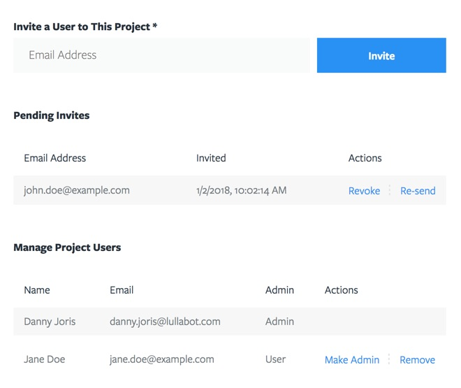

# Projects

A Tugboat Project is tied to a subscription model (free or premium), and can
contain any number of repositories. Other Tugboat users can be invited to share
a Tugboat Project. All Repositories added to a Tugboat Project share the disk
quota tied to its subscription.

## Listing Your Projects

If you have only one Project, the home page will show that project's dashboard.
If you have multiple Projects, the home page will show you a list of all
Projects you either own or have permission to view.

## Adding a Project

If you do not have any Projects, you will be presented with a form to create a
Project when you log in. If you already have one or more Projects, you can
create a new Project from the My Projects page. Navigate to this page either via
the breadcrumbs or via the My Projects links in the user dropdown menu in the
main navigation.

## Dashboard

The project dashboard is where you can manage a project's repositories, see
usage statistics, and access its settings.

## User Management

Project administrators are able to manage which Tugboat users have access to the
project. Invite users by providing their email address. They will receive an
email with an invitation link. This invitation link is valid for 24 hours, but
the user will remain in the "Pending Invites" until manually removed.

Note that the user does not have to use the email address that the invation was
sent to when signing up with Tugboat.

Once an invite has been accepted, the user can be made an administrator of the
project if so desired. Administrators have access to user permissions, payment
information, and are able to add or remove repositories.

## Project Subscription

Billing is done on a per-project basis. Each available tier has different levels
of resource availability, most notable being disk space. In addition, paid tiers
have access to Base Previews which greatly reduce the amount of disk space
required for each child Preview and can speed up build times significantly.

See [https://tugboat.qa/pricing](https://tugboat.qa/pricing) for the current
pricing tiers.

### Tier Upgrades

A Project's tier can be upgraded at any time.

When upgrading from a free plan, you will be asked for credit card information
for billing. At that point, your credit card will be charged for the full month,
and your billing cycle starts from there.

When upgrading to a higher tier paid plan you will be refunded the remaining
amount of your current plan, and charged a prorated amount for the higher tier
for the remainder of your billing cycle.

### Tier Downgrades

A Project's tier can also be downgraded at any time. However, the downgrade does
not actually take place until the end of the billing cycle. Your project will
remain at its current tier until then. At the beginning of the next billing
cycle you will be charged the new amount, and your project will be downgraded.

If a downgrade causes your project to exceed its disk quota, no new previews can
be built until space has been freed up by deleting existing previews.

## Credit Card Details

Your credit card information can be updated at any time. Tugboat attempts to
charge the currently configured card at the beginning of each billing cycle.
Changing the credit card information in between those times will NOT result in
any additional chargs.

## Deleting a Project

A project can be deleted from its settings page by any project administrator.
When a project is deleted:

* All Tugboat Repositories and Previews in the Project are deleted
* If deleting a paid plan, your credit card will NOT be charged again.

There are no refunds for the remaining balance, so be sure you really want to
delete the project first. Downgrading to a free plan before deleting will
maximize your project's availability and also prevent additional charges to your
credit card.

