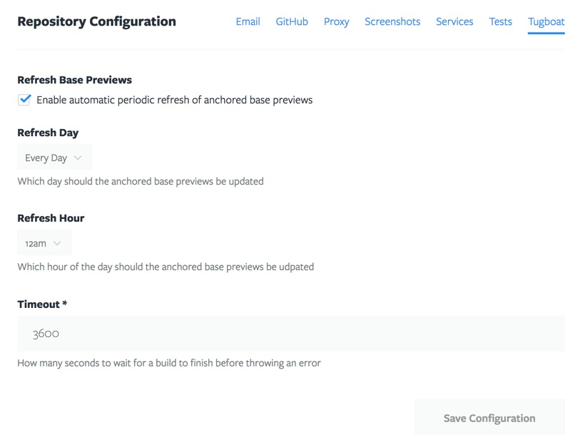
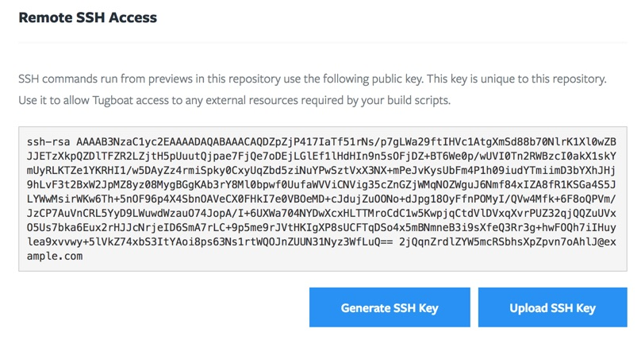

# Repository Settings

To navigate to the Repository settings, either use the link next to the title in the Repository dashboard or use one of the links in the Repository table from the Project dashboard.

## Services

Services are isolated instances that contain applications like file servers, databases, caching, etc. Under the hood they are [Docker](https://www.docker.com/) containers. While you can install any application you need from a [Makefile]() build script, we highly recommend using Services whenever available as they're easy to include and most importantly, they have their own designated CPU(s) and memory. To see how many CPU(s) and memory is designated to your Services, check out your current subscription in the [Project Settings](/tugboat-dashboard/projects/settings/#manage-subscription).

The Service which will serve up your files or will be the endpoint of the Tugboat Preview URL should be asigned as "webhead". In most cases this will be a file server like Apache.

You can give your Services a custom name, but in most cases the default will work fine.

If you would like to see a Service included that isn't listed yet, feel free to create one and make a pull request to [Lullabot/tugboat-registry](https://github.com/Lullabot/tugboat-registry). Once accepted here they will become available in Tugboat.

TODO: part about Ready Command

## Configuration

This section of the Repository Settings page bundles common configuration options, divided in sub-sections.

### Email

Here you can fill out email addresses that should receive a notification when certain events happen. Available events are:
- Successful Build
- Failed Build
- Successful Rebuild
- Failed Rebuild
- Successful Refresh
- Failed Refresh

### Github/Bitbucket/Gitlab

This section houses settings specific to the Repository provider. Specifically things that relate to connecting to the provider to set statuses and updates. A popular option is the ability to build Previews automatically each time a new Pull Request is created.

### Proxy

Proxy settings relate to how Previews are served. Configuration options around HTTP(S) and aliases can be found here.

### Screenshots

Each time Tugboat builds a preview it generates screenshots which can be found on the [Preview Dashboard](). If a Preview is built based of a Base Preview, it will generate a visual diff. If you want to change default values like highligh mask colors or timeout values you can do so here.

### Services

These are settings related to the Service containers. Here you can set a custom webhead port, application path, or one or more environment variables that will be available to every Preview for this Repository.

### Tests

Provides an option to run the repo's test suite after building every Preview.

### Tugboat

The Tugboat settings relate to building Previews and refreshing Base Previews. A common thing to do is refresh a Base Preview periodically so it stays up-to-date, for example with the latest data from a production server.

## Remote SSH Access

In some cases you may find having an SSH key assigned to your build is useful for connecting to external sources to pull in resources like database dumps, etc. You can generate a new private key on the fly, or you can upload your own. The SSH key will then be available to all Previews in this Repository.

## Delete Repository

Deleting a Repository cannot be undone. When you delete your Repository all Previews will be destroyed and all settings will be lost. Deleting a Tugboat Repository will not affect any data of the provider repository that is connected to it.

